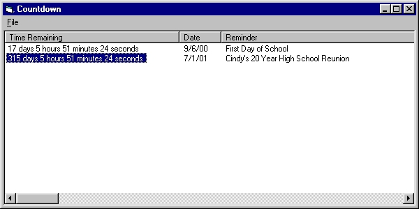



## Countdown Timer

### Description

Displays the number of days, hours, minutes, and seconds till a specified date. Allows you to enter multiple dates.

Illustrates how to use the new ListView control in VB6, saving and retrieving from the registry, and the datediff function.
 
### More Info
 

             |
---                |---
**Submitted On**   |2000-08-19 18:10:40
**By**             |[Kamilche](https://github.com/Planet-Source-Code/PSCIndex/blob/master/ByAuthor/kamilche.md)
**Level**          |Beginner
**User Rating**    |3.7 (22 globes from 6 users)
**Compatibility**  |VB 6\.0
**Category**       |[Math/ Dates](https://github.com/Planet-Source-Code/PSCIndex/blob/master/ByCategory/math-dates__1-37.md)
**World**          |[Visual Basic](https://github.com/Planet-Source-Code/PSCIndex/blob/master/ByWorld/visual-basic.md)
**Archive File**   |[CODE\_UPLOAD91358192000\.zip](https://github.com/Planet-Source-Code/kamilche-countdown-timer__1-10837/archive/master.zip)

